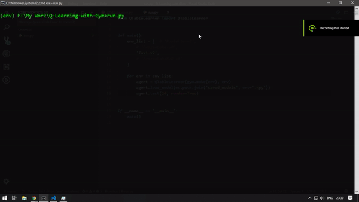

# Q-Learning with OpenAI gym

Q-Learning is an basic learning algorithm which is actually based on Dynamic Programming.Using this method we make a state space table or Q-Table which acts as a cheat sheet for the agent when it interacts with the environments.<br>
If you ❤️ this then please give a ⭐

## Installation
Clone this repository
```
git clone https://github.com/Jeetu95/Q-Learning-with-Gym.git
```
Install the required packages.
```
pip install -r requirements.txt
```
To test the saved models run this script using Python3
```
python run.py
```
## Usage

```
from QTableLearner import QTableLearner

agent = QTableLearner(gym.make(env), env)             # Creating an object the untrained agent.
agent.train(total_training_episodes, render=False)    # Training the agent for a number of episodes.
agent.save_model()                                    # To save the model in disk.
agent.load_model(path)                                # To load the model from disk.
agent.test(total_testing_episodes, render=False)      # To test performance of the agent in the paticular environment.
```

## Status

Currently the project is working on a paticular set of environments from [OpenAi gym](https://gym.openai.com/).
In future I plan on supporting the other environmets.<br>
For the timing the following environments are supported.
   ###### Rendering supported.
  - Taxi-v2          [Check it out here](https://gym.openai.com/envs/Taxi-v2/) 
  - FrozenLake-v0    [Check it out here](https://gym.openai.com/envs/FrozenLake-v0/)
  - FrozenLake8x8-v0 [Check it out here](https://gym.openai.com/envs/FrozenLake8x8-v0/)
   ###### Rendering not supported.
  - Roulette-v0      [Check it out here](https://gym.openai.com/envs/Roulette-v0/)
  
Saved models for all the environments here can be found [here](saved_models)

#### Taxi-v2
This model was trained for 1000 episodes. For better results load the model and train for more episodes.



## Contributing
Pull requests are welcome. For major changes, please open an issue first to discuss what you would like to change.

## License
This project is licensed under [MIT OPEN SOURCE LICENSE](LICENSE)
